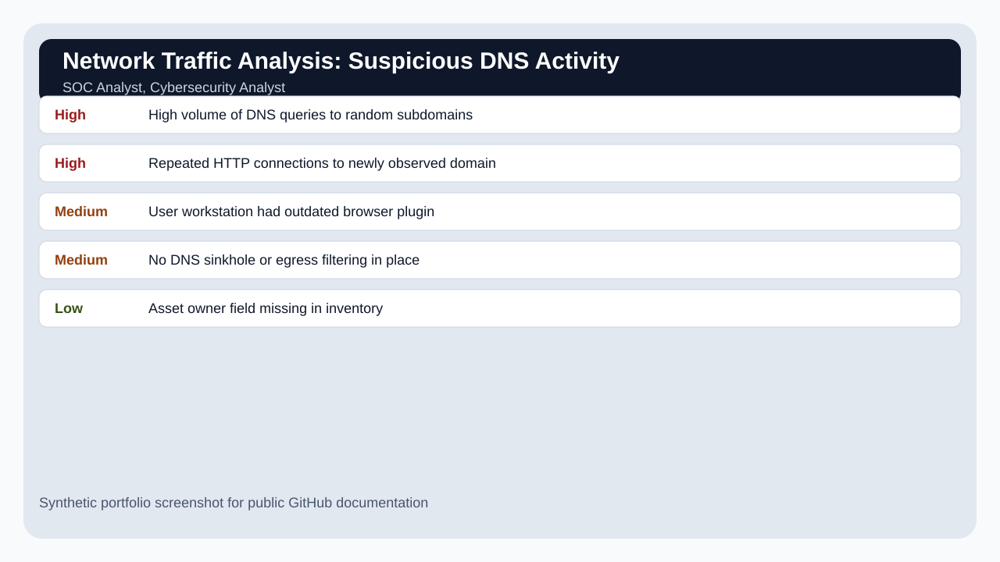

# Network Traffic Analysis: Suspicious DNS Activity

## Overview

A network analysis project using synthetic DNS and HTTP evidence to identify suspicious domain patterns, possible command-and-control behavior, and recommended detection improvements.

## Scenario

A workstation generated unusual DNS traffic to random-looking subdomains after a user reported browser pop-ups and system slowness.

## Target Roles

SOC Analyst, Cybersecurity Analyst

## Tools and Concepts Used

Wireshark/tcpdump concepts, DNS analysis, HTTP metadata review, IOC documentation

## Key Findings

| Severity / Type | Finding | Why It Matters |
|---|---|---|
| High | High volume of DNS queries to random subdomains | Possible domain generation algorithm or beaconing behavior. |
| High | Repeated HTTP connections to newly observed domain | Potential command-and-control callback. |
| Medium | User workstation had outdated browser plugin | Likely initial infection or unwanted software vector. |
| Medium | No DNS sinkhole or egress filtering in place | Weak prevention and containment capability. |
| Low | Asset owner field missing in inventory | Delayed user/device follow-up. |

## What I Did

1. Defined the scope and business scenario.
2. Reviewed synthetic evidence/data.
3. Identified security issues and mapped them to business risk.
4. Prioritized findings by severity and likelihood.
5. Wrote remediation or improvement recommendations.
6. Documented the project in a way a recruiter, hiring manager, or technical reviewer can follow.

## Screenshots

## Interview Explanation

This project shows that I can look at network behavior, not just individual alerts. I can explain why repeated DNS lookups and unusual domains matter and how defenders can reduce risk.

## How to Confidently Explain This Project

Use this structure:

1. **Situation:** Explain the business problem.
2. **Task:** Explain what security question you were trying to answer.
3. **Action:** Explain your investigation or review steps.
4. **Result:** Explain what you found and what you recommended.

Example:

> I created this project to practice the workflow used by security teams: define scope, collect evidence, identify risk, prioritize what matters, and communicate next steps. I used synthetic data so the project is safe to publish, but the process mirrors how entry-level analysts contribute in real environments.

## Beginner Mistakes This Project Avoids

- Listing tools without explaining the security outcome.
- Treating every alert or finding as equally important.
- Forgetting to explain business impact.
- Publishing real logs, IP addresses, client data, or secrets.
- Writing notes that only the author can understand.

## Files Included

- `README.md` - Project overview and explanation.
- `data/sample-data.csv` - Synthetic evidence used for the project.
- `reports/final-report.md` - Polished report-style writeup.
- `screenshots/project-summary.svg` - Public-safe screenshot mockup.
