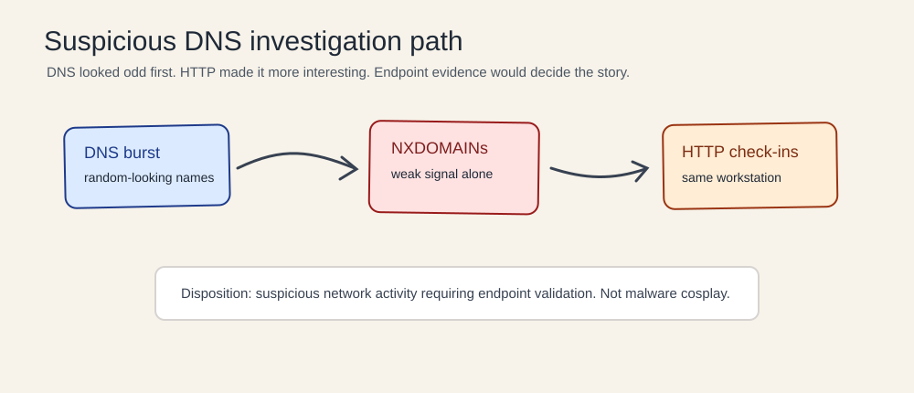
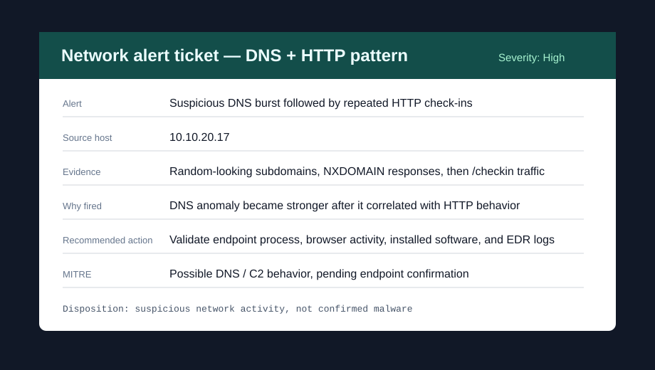
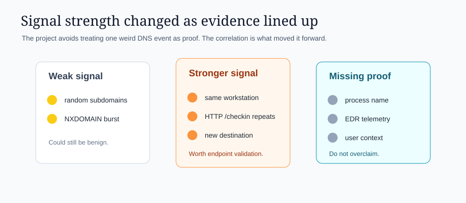

<div align="center">

# Network Traffic Analysis Lab: Suspicious DNS Activity

**A defensive network analysis project using synthetic DNS/HTTP evidence and a safe lab PCAP**  
Packet review + DNS analysis + HTTP correlation + cautious analyst disposition

   

</div>

---

## What this project demonstrates



This is a lab-based network traffic analysis project. It uses synthetic DNS/HTTP data and a benign self-generated `.pcap` to investigate traffic from one workstation.

The activity looked suspicious, but not enough to claim malware. The point of the lab is to show the analyst workflow: filter the traffic, look for patterns, compare against possible benign explanations, and decide what to check next.

All hosts, domains, IP addresses, timestamps, and packet data are synthetic or documentation-safe.

---

## Skills used

| Skill | How it shows up here |
|---|---|
| Network traffic analysis | Reviewed DNS and HTTP behavior from one workstation. |
| Packet filtering | Used focused filters instead of reading noisy packet output line by line. |
| DNS investigation | Looked at random-looking subdomains and NXDOMAIN responses. |
| Evidence correlation | Connected DNS anomalies to later HTTP check-in behavior. |
| False positive analysis | Considered browser, updater, telemetry, and ad/tracker explanations. |
| Detection logic | Documented logic for DNS bursts followed by HTTP activity. |
| Analyst communication | Kept the conclusion cautious instead of overclaiming malware. |

**Estimated time to build/recreate:** ~8–11 hours across several working sessions.  
The hardest part was not finding weird traffic. The hard part was resisting the urge to call every weird packet evil. Packets have personalities.

---

## Quick visual tour

| Alert-style summary | Signal strength |
|---|---|
|  |  |

| DNS filter view | HTTP filter view |
|---|---|
|  |  |

| Packet observations | Investigation notes |
|---|---|
|  |  |

---

## What stood out

The first thing that stood out was a burst of DNS queries from `10.10.20.17`. Several queries had short random-looking subdomains and returned NXDOMAIN. By itself, that was only a weak signal.

The severity increased when the same host later made repeated HTTP requests to `/checkin` on a newly observed destination. DNS anomalies alone were not enough to confirm compromise, but DNS plus repeated HTTP check-ins made the activity worth escalating for endpoint validation.

---

## Evidence used

| Evidence | Location |
|---|---|
| Benign lab PCAP | `captures/benign-dns-http-lab.pcap` |
| tcpdump DNS output | `tool-output/tcpdump-dns-output.txt` |
| tcpdump HTTP output | `tool-output/tcpdump-http-output.txt` |
| DNS event data | `data/dns-events.csv` |
| HTTP connection data | `data/http-connections.csv` |
| Timeline | `data/investigation-timeline.csv` |
| False positive analysis | `traffic-analysis/false-positive-analysis.md` |
| Detection examples | `detection-logic/` |
| Packet analysis notes | `traffic-analysis/pcap-wireshark-analysis.md` |
| Analyst journal | `docs/analyst-journal.md` |

---

## One example network alert

| Field | Detail |
|---|---|
| Alert | Suspicious DNS burst followed by repeated HTTP check-ins |
| Severity | High for triage, pending endpoint validation |
| Source host | `10.10.20.17` |
| Evidence | Random-looking subdomains, NXDOMAIN responses, same host later making repeated `/checkin` requests. |
| Reason fired | DNS anomaly became stronger after it correlated with HTTP behavior from the same workstation. |
| Recommended action | Validate endpoint process, browser activity, installed software, EDR logs, and user context. |
| Disposition | Suspicious network activity requiring endpoint validation, not confirmed malware. |

This is the kind of alert where I would rather be careful and useful than dramatic and wrong.

---

## Filters used

```text
dns
```

```text
http || tcp.port == 80
```

```text
ip.addr == 10.10.20.17
```

The initial packet output was noisy, so the review was narrowed to DNS first, then HTTP traffic from the same workstation.

---

## Why this was suspicious

| Signal | Why it mattered |
|---|---|
| Similar random-looking subdomains | Could indicate automated domain generation or unwanted software behavior. |
| Multiple NXDOMAIN responses | Failed generated domains can be a weak signal. |
| Newly observed destination | The destination was not part of known normal traffic in the lab. |
| Repeated `/checkin` requests | Repetition at intervals made the traffic more concerning. |
| Same source host | DNS and HTTP activity tied back to one workstation. |

---

## Project structure

```text
Network-Traffic-Analysis-Suspicious-DNS/
├── captures/                     # Benign lab PCAP
├── data/                         # Synthetic DNS, HTTP, and timeline data
├── detection-logic/              # Detection examples
├── docs/                         # Analyst journal and portfolio visuals
│   └── images/                   # README visuals
├── screenshots/                  # Original SVG packet screenshots
├── tool-output/                  # tcpdump output samples
├── traffic-analysis/             # Packet notes and false positive analysis
└── README.md
```

---

## What I got wrong first

My first version put too much weight on DNS alone. Random-looking subdomains and NXDOMAINs are useful clues, but they can also come from normal software, browser behavior, ad/tracker activity, and misconfigured applications.

I adjusted the conclusion after correlating DNS with the repeated `/checkin` HTTP traffic from the same workstation. That made the signal stronger, but still not strong enough to claim confirmed malware without endpoint telemetry.

More notes are in `docs/analyst-journal.md`.

---

## False positives considered

This could still be benign. Software updates, browser prefetching, security agent telemetry, misconfigured applications, or ad/tracker traffic can all create unusual DNS and HTTP patterns.

Without endpoint telemetry, process information, browser history, or EDR data, the investigation cannot confirm execution or malware.

---

## Current conclusion

**Disposition:** suspicious network activity requiring endpoint validation.

**Severity:** High for triage purposes, not because compromise is confirmed, but because DNS anomalies correlated with repeated outbound HTTP check-ins.

---

## What I would improve next since Rome did not resolve every domain in one query

1. Add endpoint telemetry for the process that generated the traffic.
2. Add Zeek-style logs alongside the packet view.
3. Add a benign comparison case with browser or updater traffic.
4. Add a SIEM-style dashboard screenshot.
5. Tune detection logic to reduce DNS-only false positives.

---

## Important note

This is a defensive portfolio lab using fictional and safe lab data. It is meant to show investigation reasoning, not to claim confirmed malware analysis experience.
