# Network Traffic Analysis Lab: Suspicious DNS Activity

## Overview

This repository contains a **lab-based network traffic analysis investigation** using synthetic DNS and HTTP event data. It demonstrates how an analyst can identify suspicious DNS behavior, explain why it matters, correlate it with outbound HTTP activity, document indicators, consider false positives, and recommend defensive actions.

This is intentionally framed as a lab. It does not use real packet captures or production logs. The purpose is to demonstrate beginner-friendly analysis workflow, detection logic, and security reasoning using public-safe data.

> All hosts, domains, IP addresses, timestamps, and traffic records are synthetic and safe for public use.

---

## Business Scenario

A billing workstation generated a burst of random-looking DNS queries followed by repeated HTTP connections to a newly observed destination. The user also reported browser pop-ups and system slowness. The analyst needs to determine whether the activity is benign, suspicious, or requires containment.

The investigation answers five questions:

1. Which host generated the suspicious traffic?
2. What DNS pattern was observed?
3. Why is the pattern suspicious?
4. Did the DNS activity correlate with outbound HTTP check-ins?
5. What false positives should be considered before escalation?

---

## Target Roles

| Role | Why This Repository Fits |
|---|---|
| SOC Analyst | Shows network event review, suspicious pattern analysis, IOC documentation, and triage logic |
| Cybersecurity Analyst | Demonstrates DNS/HTTP analysis, severity rating, detection ideas, and recommendations |
| Incident Response Analyst, beginner | Connects suspicious traffic to containment and validation steps |
| Security Implementation Specialist | Connects findings to DNS filtering, SIEM detections, logging, and endpoint hardening improvements |

---

## Lab Framing

This repository uses synthetic evidence instead of real packet captures.

| Item | Status |
|---|---|
| Real packet capture `.pcap` | Included as a benign self-generated lab capture |
| Wireshark screenshot | Included as Wireshark-style DNS and HTTP filter views |
| tcpdump command output | Included in `tool-output/` |
| SIEM queries | Example Splunk, Microsoft Sentinel KQL, Chronicle UDM, and Sigma-style logic included |
| Production logs | Not included |
| Synthetic DNS and HTTP data | Included |

The capture is safe and benign. It is designed to demonstrate packet review workflow without using malware traffic or real company data.

---

## Core Deliverables

| Area | Deliverables |
|---|---|
| DNS Analysis | Query length, subdomain pattern, response type, frequency, and suspicious TLD review |
| HTTP Correlation | Outbound check-in pattern after DNS anomaly |
| Timeline | DNS burst followed by repeated HTTP requests |
| Severity Rating | Low / Medium / High finding severity with reasoning |
| False Positive Analysis | Benign causes that could look similar |
| Detection Logic | Splunk SPL, Microsoft Sentinel KQL, Chronicle UDM-style, Sigma-style, and tcpdump examples |
| Response | Containment and remediation recommendations |
| Reporting | Executive summary and analyst report |

---


## Hands-On Packet Capture Layer

This version adds a benign `.pcap` so the repo includes actual packet-level evidence in addition to CSV data and detection logic.

| Artifact | Location |
|---|---|
| Benign lab PCAP | `captures/benign-dns-http-lab.pcap` |
| DNS tcpdump output | `tool-output/tcpdump-dns-output.txt` |
| HTTP tcpdump output | `tool-output/tcpdump-http-output.txt` |
| PCAP analysis notes | `traffic-analysis/pcap-wireshark-analysis.md` |
| Packet evidence summary | `reports/packet-evidence-summary.md` |

### Wireshark DNS Filter View

Filter used:

```text
dns
```

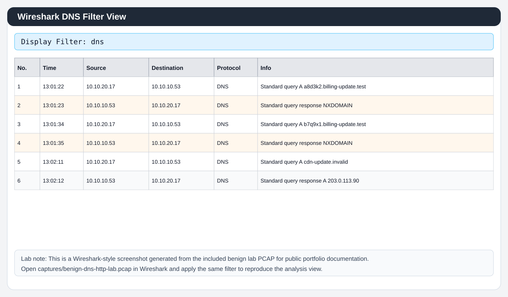

### Wireshark HTTP Filter View

Filter used:

```text
http || tcp.port == 80
```

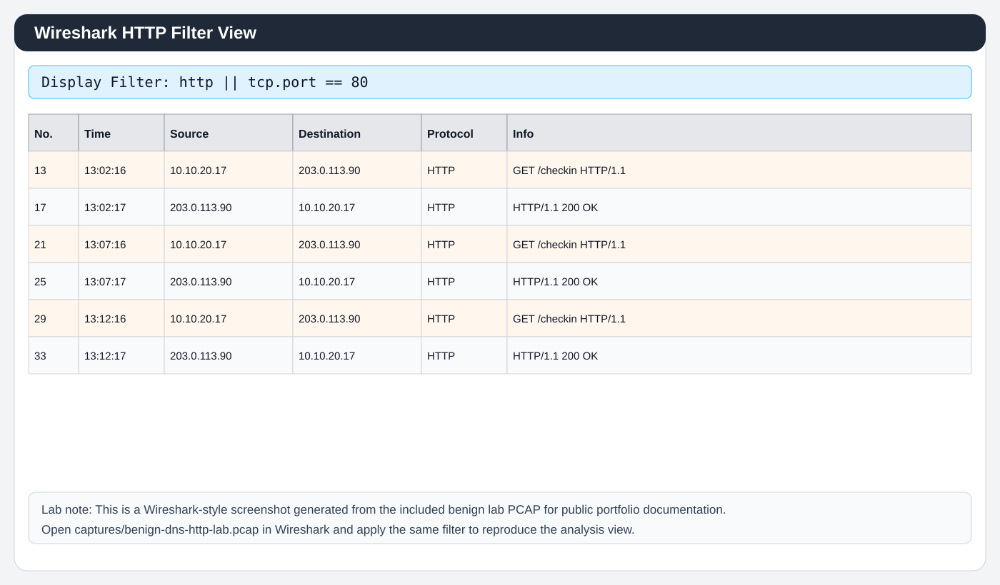

### Packet Observations

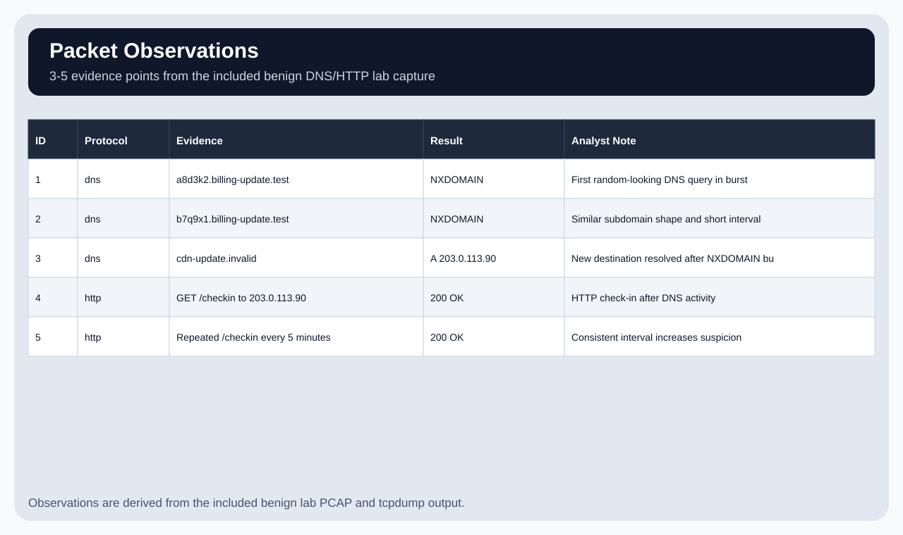

---

## Analysis Workflow

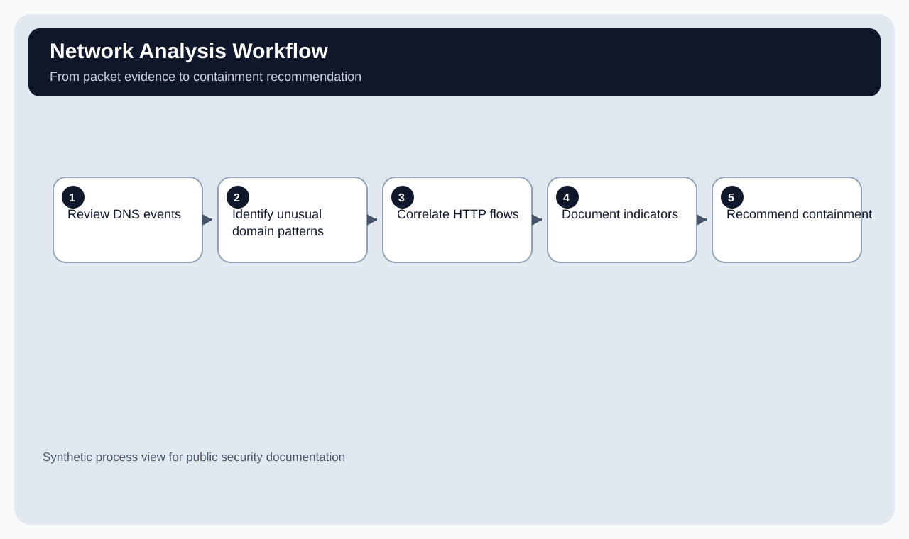

---

## DNS Activity Dashboard

The DNS dashboard includes query length, subdomain length, TLD, response type, and analyst notes.

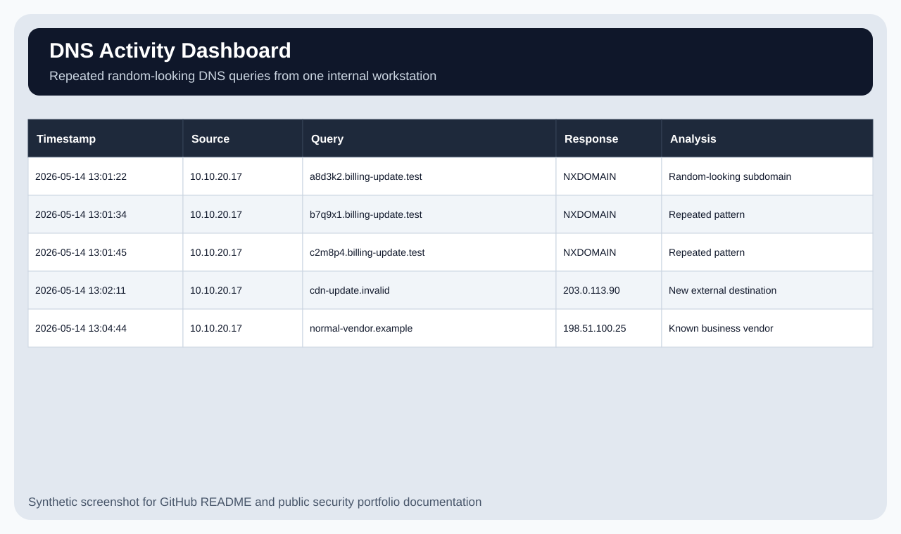

---

## Suspicious DNS Criteria

This section explains **why** the DNS behavior is suspicious in beginner-friendly analyst terms.

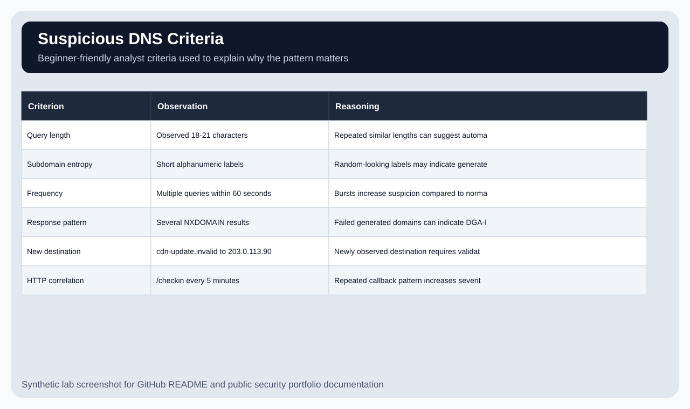

---

## DNS-to-HTTP Timeline

The timeline shows suspicious DNS activity followed by repeated HTTP check-ins.

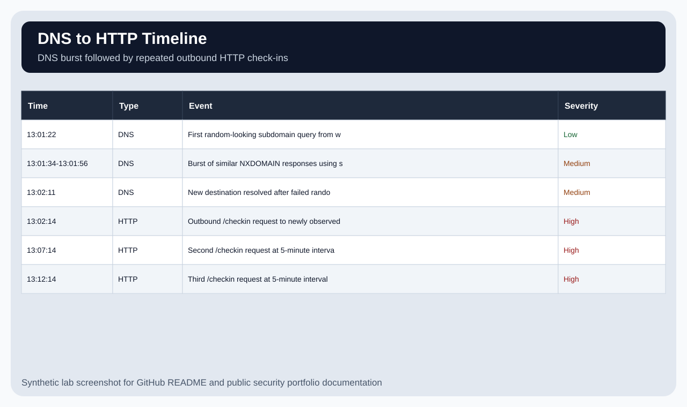

---

## Severity Rating

Findings are rated Low, Medium, or High with reasoning.

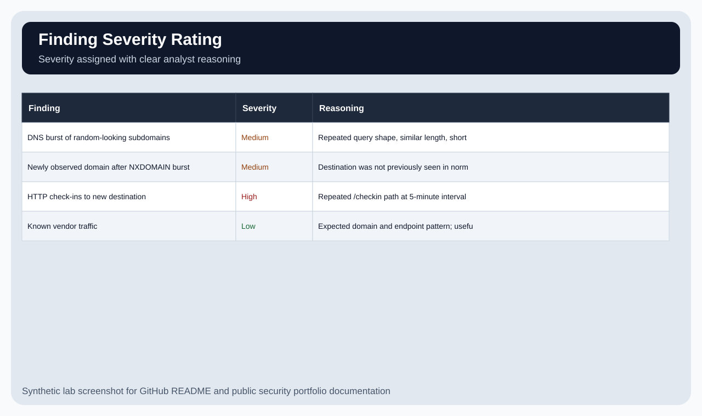

---

## HTTP Flow Summary

The HTTP flow summary shows repeated outbound check-ins after the suspicious DNS activity.

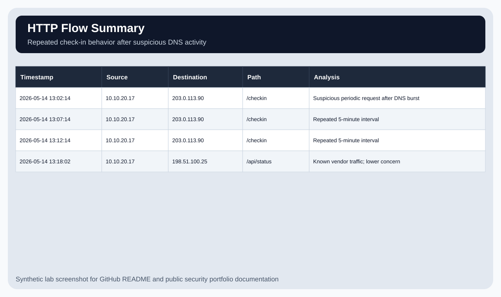

---

## False Positive Analysis

The investigation considers benign explanations before recommending escalation.

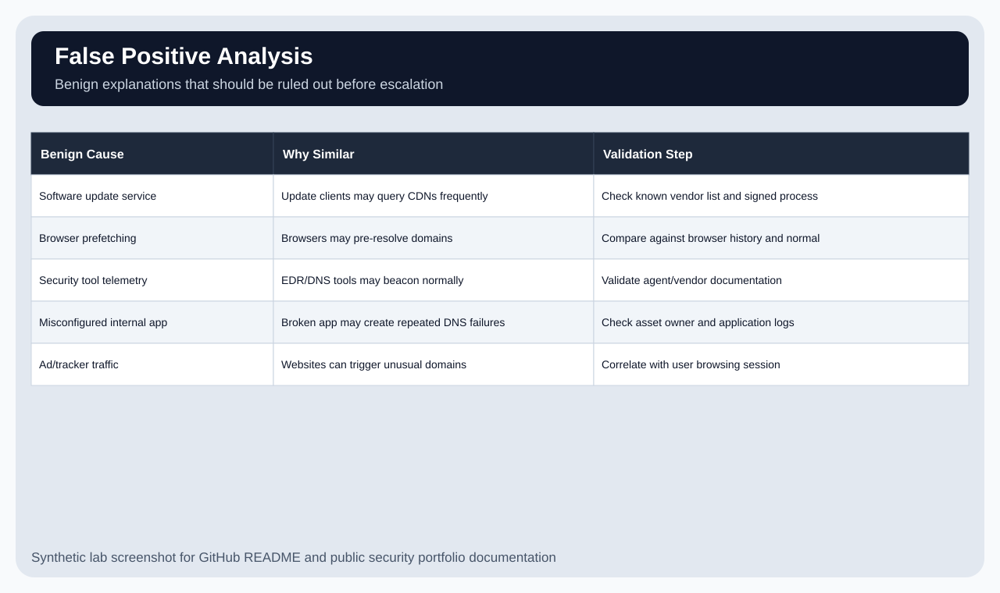

---

## IOC Table

Indicators are documented with reason and recommended defensive action.

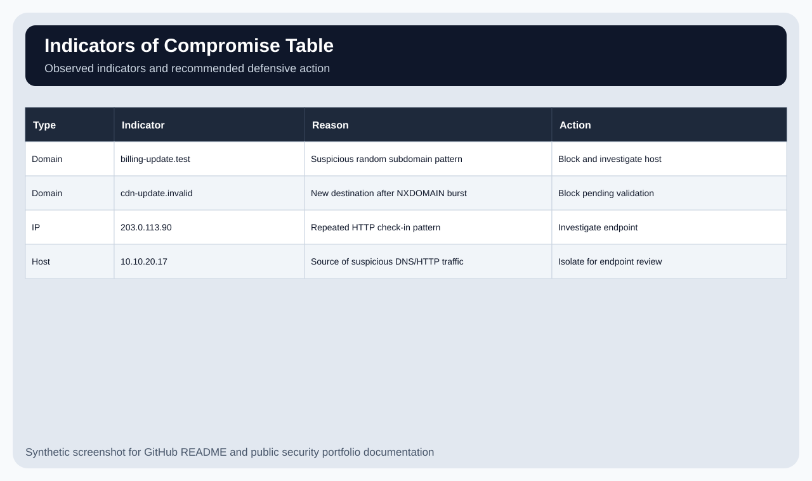

---

## Recommendation Matrix

Recommendations are prioritized by security value and business reason.

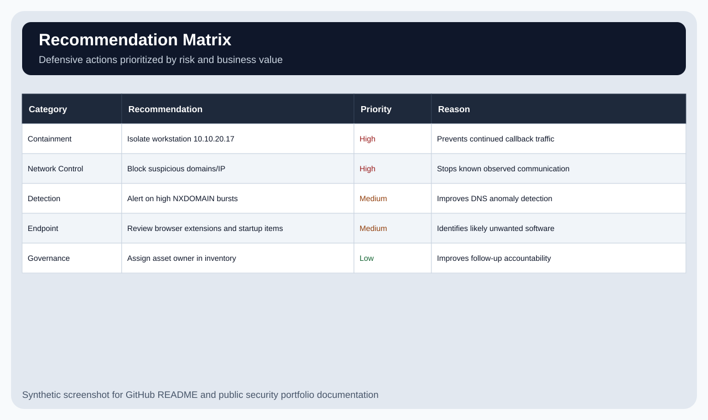

---

## Repository Structure

```text
.
├── README.md
├── CHANGELOG.md
├── COMMIT_GUIDE.md
├── traffic-analysis/
├── data/
├── evidence/
├── detection-logic/
├── response/
├── reports/
├── screenshots/
└── templates/
```

---

## Key Evidence Files

| File | Purpose |
|---|---|
| `captures/benign-dns-http-lab.pcap` | Benign self-generated packet capture for Wireshark/tcpdump review |
| `tool-output/tcpdump-dns-output.txt` | DNS packet review output |
| `tool-output/tcpdump-http-output.txt` | HTTP packet review output |
| `traffic-analysis/pcap-wireshark-analysis.md` | Filters used, packet observations, and what the packet evidence proves |
| `data/dns-events.csv` | Synthetic DNS query evidence with query length, TLD, response, and analyst notes |
| `data/http-connections.csv` | Synthetic outbound HTTP flow evidence |
| `data/investigation-timeline.csv` | DNS-to-HTTP event timeline |
| `data/severity-rating.csv` | Severity ratings with reasoning |
| `data/suspicious-dns-criteria.csv` | Analyst criteria used to explain suspicious DNS |
| `data/false-positive-analysis.csv` | Benign explanations and validation steps |
| `data/ioc-list.csv` | Indicator list with action recommendations |
| `traffic-analysis/dns-analysis-notes.md` | Analyst review of DNS behavior |
| `traffic-analysis/http-correlation-notes.md` | DNS-to-HTTP correlation notes |
| `traffic-analysis/false-positive-analysis.md` | Benign causes and validation steps |
| `detection-logic/splunk-spl-examples.md` | Splunk-style detection examples |
| `detection-logic/microsoft-sentinel-kql-examples.md` | KQL-style detection examples |
| `detection-logic/chronicle-udm-examples.md` | Google SecOps / Chronicle UDM-style examples |
| `detection-logic/sigma-style-rule.yml` | Pseudo-Sigma detection logic |
| `detection-logic/tcpdump-examples.md` | Basic packet capture command examples |
| `reports/final-report.md` | Final analyst report |

---

## Analyst Conclusion

The activity should be treated as **High severity suspicious network activity** because one workstation generated a burst of random-looking DNS queries, received multiple NXDOMAIN responses, resolved a newly observed destination, and then made repeated HTTP `/checkin` requests at consistent intervals.

DNS anomalies alone do not prove compromise. The severity increases because the DNS pattern is correlated with repeated outbound HTTP behavior.

---

## Limitations

This is a synthetic network traffic analysis lab. It does not contain real packet captures, real Wireshark screenshots, malware, production logs, or customer data.
